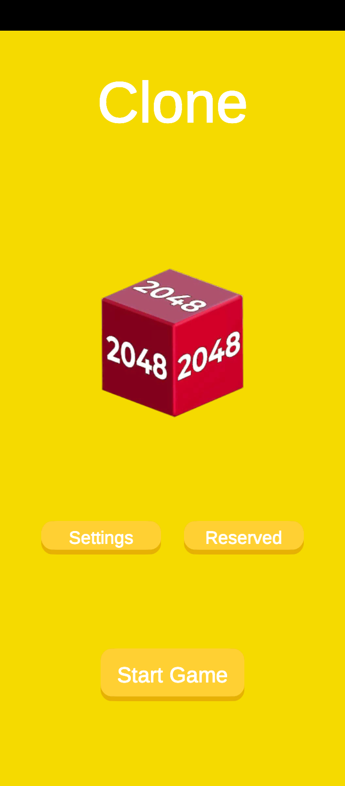
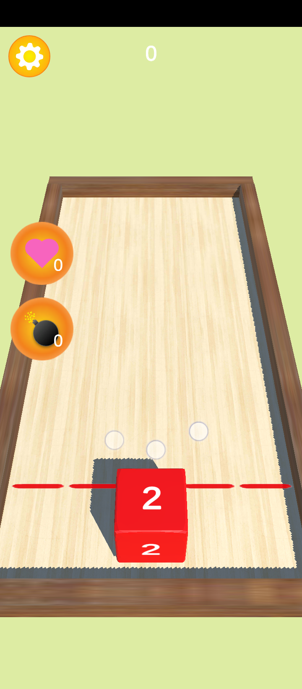
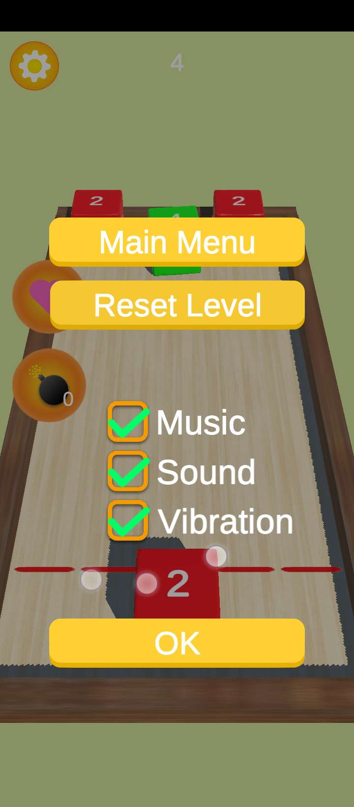
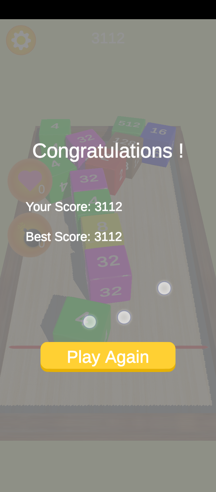
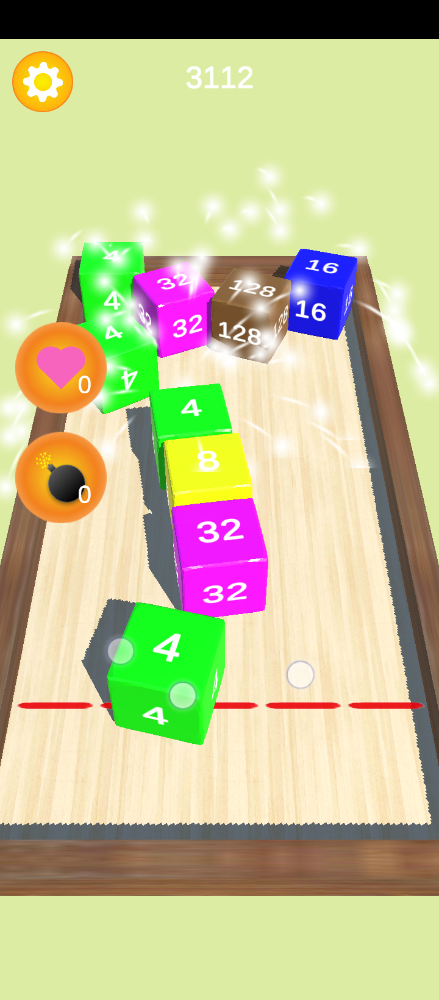

# Hyper-Casual-Game-Clone

## Description
This is an attempt to clone a hypercasual game from the play store using Unity3D game engine. the Result is not 100% clone of the original one, i took liberty to do some change here and there.
the different UI element are create me using Adobe XD, the music and sound effects are downloaded from https://opengameart.org/ and all the rest is done in the engine.

the project want be open source for the moment.

## Screenshots
<table border = 0 >
<tr>
	<td></td>
	<td></td>
	<td></td>
</tr>
<tr>
	<td></td>
	<td></td>
</tr>
</table>